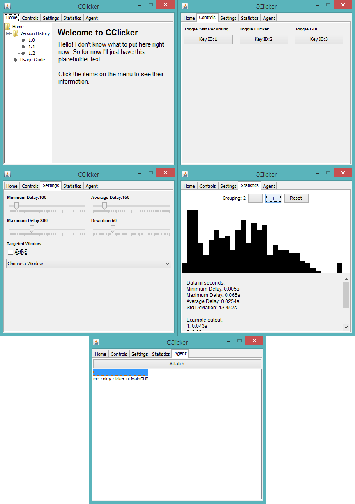

# About

CClicker is a simple auto-clicker made using JNA and Apache's Math library.

# Features

* Hideable window
* [Normal-distribution](https://en.wikipedia.org/wiki/Normal_distribution) based randomization
  * Record your own clicking statistics and simulate it
* All settings accessible via GUI
* Translatable GUI text using txt files

# Images

